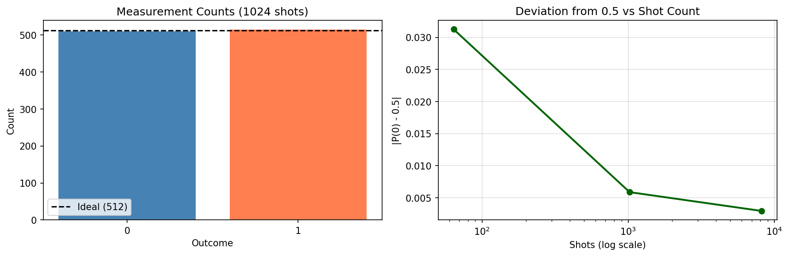
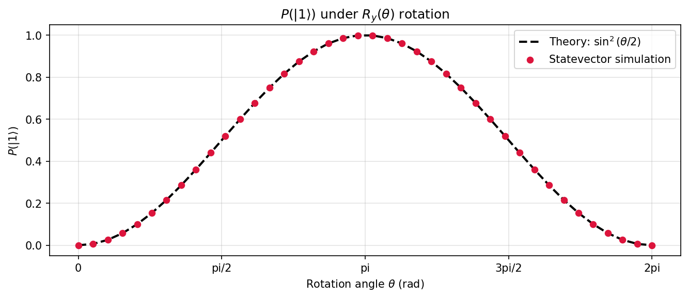

# **Chapter 1: Introduction to Quantum Computing (Codebook)**

This codebook bridges the conceptual introduction of Chapter 1 into hands-on Qiskit practice. Each project is self-contained and runnable. Build single-qubit circuits, simulate measurement statistics, and survey canonical quantum states.

---

**Expected outputs** from `codes/codebook_02.py`:

- `codes/ch1_ry_sweep.png`
- `codes/ch1_superposition_stats.png`

## Project 1: Superposition and Measurement Statistics

| Feature | Description |
| :--- | :--- |
| **Goal** | Create a single-qubit superposition state with a Hadamard gate and observe the 50/50 measurement distribution over many shots. |
| **Circuit** | $H\|0\rangle = \|{+}\rangle$, then measure. |
| **Method** | Aer shot-based simulation at 64, 1024, and 8192 shots to demonstrate statistical convergence toward ideal probabilities. |

---

### Complete Python Code

```python
from qiskit import QuantumCircuit
from qiskit_aer import AerSimulator
import matplotlib.pyplot as plt
import numpy as np

# Build the single-qubit Hadamard circuit

qc = QuantumCircuit(1, 1)
qc.h(0)
qc.measure(0, 0)

print("=== Circuit ===")
print(qc.draw(output="text"))

backend = AerSimulator()

results = {}
for shots in [64, 1024, 8192]:
    job    = backend.run(qc, shots=shots)
    counts = job.result().get_counts()
    p0     = counts.get("0", 0) / shots
    p1     = counts.get("1", 0) / shots
    results[shots] = (p0, p1)
    print(f"shots={shots:5d}  P(0)={p0:.4f}  P(1)={p1:.4f}  "
          f"|deviation|={abs(p0 - 0.5):.4f}")

# Convergence plot

shot_vals  = [64, 1024, 8192]
deviations = [abs(results[s][0] - 0.5) for s in shot_vals]

fig, axes = plt.subplots(1, 2, figsize=(12, 4))

counts_1024 = backend.run(qc, shots=1024).result().get_counts()
axes[0].bar(counts_1024.keys(), counts_1024.values(), color=["steelblue", "coral"])
axes[0].axhline(512, color="k", linestyle="--", label="Ideal (512)")
axes[0].set_title("Measurement Counts (1024 shots)")
axes[0].set_xlabel("Outcome")
axes[0].set_ylabel("Count")
axes[0].legend()

axes[1].semilogx(shot_vals, deviations, "o-", color="darkgreen", linewidth=2)
axes[1].set_title("Deviation from 0.5 vs Shot Count")
axes[1].set_xlabel("Shots (log scale)")
axes[1].set_ylabel("|P(0) - 0.5|")
axes[1].grid(True, alpha=0.4)

plt.tight_layout()
plt.savefig("codes/ch1_superposition_stats.png", dpi=150, bbox_inches="tight")
plt.show()
print("Saved: codes/ch1_superposition_stats.png")
```


**Sample Output:**
```python
=== Circuit ===
     ┌───┐┌─┐
  q: ┤ H ├┤M├
     └───┘└╥┘
c: 1/══════╩═
           0 
shots=   64  P(0)=0.5312  P(1)=0.4688  |deviation|=0.0312
shots= 1024  P(0)=0.4941  P(1)=0.5059  |deviation|=0.0059
shots= 8192  P(0)=0.5029  P(1)=0.4971  |deviation|=0.0029
Saved: codes/ch1_superposition_stats.png
```

---

## Project 2: Qubit Rotation and Born's Rule Verification

| Feature | Description |
| :--- | :--- |
| **Goal** | Rotate a qubit with $R_y(\theta)$ over $\theta \in [0, 2\pi]$ and plot $P(\|1\rangle) = \sin^2(\theta/2)$, confirming Born's rule numerically. |
| **Method** | Parameterised `Ry` circuit evaluated at 40 angles via `Statevector`. |

---

### Complete Python Code

```python
from qiskit import QuantumCircuit
from qiskit.quantum_info import Statevector
import numpy as np
import matplotlib.pyplot as plt

angles       = np.linspace(0, 2 * np.pi, 40)
prob_1_sim   = []
prob_1_theory = np.sin(angles / 2) ** 2

for theta in angles:
    qc = QuantumCircuit(1)
    qc.ry(theta, 0)
    sv = Statevector.from_instruction(qc)
    prob_1_sim.append(float(sv.probabilities()[1]))

fig, ax = plt.subplots(figsize=(9, 4))
ax.plot(angles, prob_1_theory, "k--", linewidth=2, label=r"Theory: $\sin^2(\theta/2)$")
ax.scatter(angles, prob_1_sim, color="crimson", s=30, zorder=5, label="Statevector simulation")
ax.set_title(r"$P(|1\rangle)$ under $R_y(\theta)$ rotation")
ax.set_xlabel(r"Rotation angle $\theta$ (rad)")
ax.set_ylabel(r"$P(|1\rangle)$")
ax.set_xticks([0, np.pi/2, np.pi, 3*np.pi/2, 2*np.pi])
ax.set_xticklabels(["0", "pi/2", "pi", "3pi/2", "2pi"])
ax.legend()
ax.grid(True, alpha=0.35)
plt.tight_layout()
plt.savefig("codes/ch1_ry_sweep.png", dpi=150, bbox_inches="tight")
plt.show()

max_err = max(abs(a - b) for a, b in zip(prob_1_sim, prob_1_theory))
print(f"Max numerical error (simulation vs theory): {max_err:.2e}")
```


**Sample Output:**
```python
Max numerical error (simulation vs theory): 0.00e+00
```

---

## Project 3: Multi-State Statevector Survey

| Feature | Description |
| :--- | :--- |
| **Goal** | Construct five canonical single-qubit states ($\|0\rangle, \|1\rangle, \|+\rangle, \|-\rangle, \|i\rangle$) and display amplitudes, probabilities, and Bloch coordinates side by side. |
| **Method** | `qiskit.quantum_info.Statevector` arithmetic; analytic Bloch vector formula. |

---

### Complete Python Code

```python
from qiskit.quantum_info import Statevector, SparsePauliOp
import numpy as np

states = {
    "|0>":  Statevector([1, 0]),
    "|1>":  Statevector([0, 1]),
    "|+>":  Statevector([1/np.sqrt(2),  1/np.sqrt(2)]),
    "|->":  Statevector([1/np.sqrt(2), -1/np.sqrt(2)]),
    "|i>":  Statevector([1/np.sqrt(2),  1j/np.sqrt(2)]),
}

X_op = SparsePauliOp("X")
Y_op = SparsePauliOp("Y")
Z_op = SparsePauliOp("Z")

print(f"{'State':>6}  {'P(|0>)':>8}  {'P(|1>)':>8}  "
      f"{'<X>':>7}  {'<Y>':>7}  {'<Z>':>7}  {'||psi||':>9}")
print("-" * 65)

for name, sv in states.items():
    probs = sv.probabilities()
    ex   = float(sv.expectation_value(X_op).real)
    ey   = float(sv.expectation_value(Y_op).real)
    ez   = float(sv.expectation_value(Z_op).real)
    norm = np.linalg.norm(sv.data)
    print(f"{name:>6}  {probs[0]:>8.4f}  {probs[1]:>8.4f}  "
          f"{ex:>7.4f}  {ey:>7.4f}  {ez:>7.4f}  {norm:>9.8f}")

print()
print("Bloch sphere constraint verification:")
for name, sv in states.items():
    ex = float(sv.expectation_value(X_op).real)
    ey = float(sv.expectation_value(Y_op).real)
    ez = float(sv.expectation_value(Z_op).real)
    r  = np.sqrt(ex**2 + ey**2 + ez**2)
    print(f"  {name}: |r| = {r:.8f}  (pure state => |r|=1)")
```
**Sample Output:**
```python
State    P(|0>)    P(|1>)      <X>      <Y>      <Z>    ||psi||

---

   |0>    1.0000    0.0000   0.0000   0.0000   1.0000  1.00000000
   |1>    0.0000    1.0000   0.0000   0.0000  -1.0000  1.00000000
   |+>    0.5000    0.5000   1.0000   0.0000   0.0000  1.00000000
   |->    0.5000    0.5000  -1.0000   0.0000   0.0000  1.00000000
   |i>    0.5000    0.5000   0.0000   1.0000   0.0000  1.00000000

Bloch sphere constraint verification:
  |0>: |r| = 1.00000000  (pure state => |r|=1)
  |1>: |r| = 1.00000000  (pure state => |r|=1)
  |+>: |r| = 1.00000000  (pure state => |r|=1)
  |->: |r| = 1.00000000  (pure state => |r|=1)
  |i>: |r| = 1.00000000  (pure state => |r|=1)
```

---

## Notes For Chapter Bridge

Chapter 1 establishes the measurement postulate and the Bloch sphere picture. In Chapter 2 you will use these foundations to build multi-qubit states, operators, and entanglement, extending the single-qubit tools here into higher-dimensional Hilbert spaces.