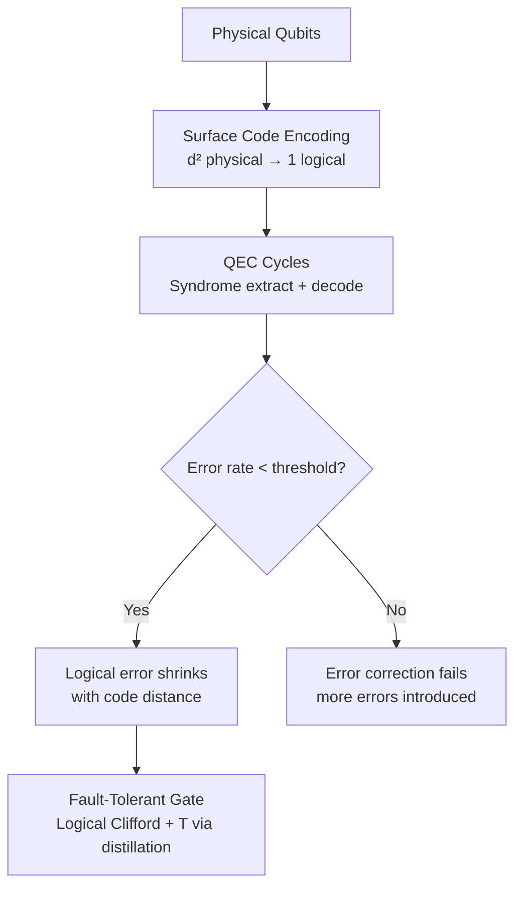

# **Chapter 20: Quantum Error Correction**

---

# **Introduction**

The dream of fault-tolerant quantum computing — running arbitrary quantum algorithms with arbitrarily low logical error rates — rests on one of the most surprising and non-obvious results in quantum information theory: the **quantum error correction threshold theorem**. This theorem guarantees that, provided physical error rates fall below a critical threshold (typically ~1% for leading codes), it is possible to protect quantum information indefinitely by encoding logical qubits into entangled states of many physical qubits, detecting and correcting errors without ever measuring (and thus collapsing) the encoded logical state.

**Quantum error correction (QEC)** addresses three unique challenges that have no classical analogue: (1) quantum states cannot be copied (the **no-cloning theorem**), ruling out simple repetition codes; (2) errors are **continuous** (any rotation of the Bloch sphere is an error), requiring a discrete correction scheme; (3) **measurement collapses** quantum states, so error detection must be indirect. Despite these constraints, QEC is achievable through clever exploitation of quantum entanglement and the stabilizer formalism.

This chapter develops QEC from first principles. We begin with the 3-qubit bit-flip and phase-flip repetition codes — the simplest codes that illustrate the structure of syndrome measurement and error correction. We then introduce the **stabilizer formalism** — the algebraic framework underlying all practical QEC codes. We examine the **Shor 9-qubit code** as the first code correcting arbitrary single-qubit errors, and close with the **Steane 7-qubit code** and a brief overview of the **surface code** — the leading candidate for near-term fault-tolerant quantum computing [1, 2, 3].

---

# **Chapter 20: Outline**

| **Sec.** | **Title** | **Core Ideas & Examples** |
| :--- | :--- | :--- |
| **20.1** | Classical vs Quantum Error Models | Bit-flip channel, phase-flip channel, depolarising, no-cloning constraints |
| **20.2** | 3-Qubit Repetition Codes | Bit-flip code, phase-flip code, syndrome measurement, error correction |
| **20.3** | Stabilizer Formalism and CSS Codes | Stabilizer group, check matrix, Calderbank-Shor-Steane construction |
| **20.4** | The Steane Code and Surface Code | 7-qubit code, surface code topology, threshold, logical gate overhead |

---

## **20.1 Classical vs Quantum Error Models**

---

In classical information theory, the elementary noise model is the **binary symmetric channel**: each transmitted bit independently flips with probability $p$. A 3-bit repetition code ($0 \to 000$, $1 \to 111$) corrects any single-bit flip by majority vote.

Quantum errors are more complex because the qubit state space is continuous:

$$
|\psi\rangle = \alpha|0\rangle + \beta|1\rangle \in \mathbb{C}^2
$$

Any perturbation $\alpha \to \alpha + \delta\alpha$ is an error, and there are **infinitely many** distinct error operators. However, a remarkable result shows that if a code corrects the Pauli basis errors $\{I, X, Y, Z\}$, it corrects **all** errors (via linearity of quantum mechanics).

### **Single-Qubit Error Channels**

---

The three fundamental quantum error channels are:

**Bit-flip channel** (X error):
$$
\mathcal{E}_{\text{bit}}(\rho) = (1-p)\rho + p X\rho X
$$

**Phase-flip channel** (Z error):
$$
\mathcal{E}_{\text{phase}}(\rho) = (1-p)\rho + p Z\rho Z
$$

**Depolarising channel** (X, Y, Z errors with equal probability):
$$
\mathcal{E}_{\text{dep}}(\rho) = \left(1 - \frac{4p}{3}\right)\rho + \frac{p}{3}(X\rho X + Y\rho Y + Z\rho Z)
$$

!!! tip "Why Do X Errors and Z Errors Require Separate Codes?"
    X errors (bit flips: $|0\rangle \leftrightarrow |1\rangle$) and Z errors (phase flips: $|+\rangle \leftrightarrow |-\rangle$) live in **dual bases**: X errors are detectable by Z measurements; Z errors are detectable by X measurements. The Shor code combines a bit-flip code (in the X basis) and a phase-flip code (in the Z basis) to protect against both, at the cost of using 9 physical qubits.
    
### **The No-Cloning Theorem**

---

A critical constraint is the **no-cloning theorem**: no quantum operation can copy an unknown quantum state:

$$
U|\psi\rangle|0\rangle = |\psi\rangle|\psi\rangle \quad \text{is impossible for arbitrary } |\psi\rangle
$$

This does not prevent **redundant encoding**: we can spread information across an entangled multi-qubit state $|\bar{\psi}\rangle$ that is not a simple product of copies. The information is distributed non-locally in the entangled state, making it immune to local errors.

!!! example "Why the Classical Repetition Code Fails Directly"
    Attempting to "copy" $|\psi\rangle = \alpha|0\rangle + \beta|1\rangle$ via three CNOTs gives:
    $$(\alpha|0\rangle + \beta|1\rangle)|00\rangle \to \alpha|000\rangle + \beta|111\rangle$$
    This is an **entangled** state (the 3-qubit GHZ state), not three independent copies. Majority-vote measurement of individual qubits collapses $|\psi\rangle$ — but **indirect syndrome measurement** preserves it, as we see next.
    
---

## **20.2 3-Qubit Repetition Codes**

---

### **The Bit-Flip Code**

---

The 3-qubit **bit-flip code** encodes one logical qubit into three physical qubits:

$$
|{\bar{0}}\rangle = |000\rangle, \quad |{\bar{1}}\rangle = |111\rangle
$$

Encoding circuit:
```python
|ψ⟩ ——●——●——
|0⟩ ——⊕———
|0⟩ ————⊕—
```

An arbitrary logical state $|\bar{\psi}\rangle = \alpha|000\rangle + \beta|111\rangle$ is protected against single-qubit X errors ($|000\rangle \to |100\rangle$, etc.) by detecting which qubit flipped via **syndrome measurement**.

**Syndrome measurement** uses two ancilla qubits to measure **stabilisers** $Z_1Z_2$ and $Z_2Z_3$ without extracting any information about the logical state $(\alpha, \beta)$:

| Error | $Z_1Z_2$ outcome | $Z_2Z_3$ outcome | Correction |
| :--- | :--- | :--- | :--- |
| None | $+1$ | $+1$ | $I$ |
| $X_1$ | $-1$ | $+1$ | $X_1$ |
| $X_2$ | $-1$ | $-1$ | $X_2$ |
| $X_3$ | $+1$ | $-1$ | $X_3$ |

The syndrome measurement eigenvalues $\pm 1$ identify the error **without** revealing the logical state — the key property that distinguishes QEC from classical error detection.

!!! tip "Syndromes Are Not Direct State Measurements"
    A syndrome measurement measures multi-qubit **Pauli products** ($Z_1Z_2$, etc.), which commute with the logical operators $\bar{X} = X_1X_2X_3$ and $\bar{Z} = Z_1Z_2Z_3$. This preserves the logical information $(\alpha, \beta)$ while uniquely identifying single-qubit errors — the fundamental mechanism of all stabilizer QEC codes.
    
### **The Phase-Flip Code**

---

The 3-qubit **phase-flip code** encodes in the Hadamard basis:

$$
|\bar{0}\rangle = |{+++}\rangle, \quad |{\bar{1}}\rangle = |{---}\rangle
$$

where $|\pm\rangle = (|0\rangle \pm |1\rangle)/\sqrt{2}$. Encoding applies Hadamard after the bit-flip encoding:

The phase-flip code detects **Z errors** via $X_1X_2$ and $X_2X_3$ syndrome measurements. Together, bit-flip and phase-flip codes protect against their respective single-qubit error types on 3 physical qubits each.

!!! example "Phase-Flip Syndrome Table"
    | Error | $X_1X_2$ | $X_2X_3$ | Correction |
    |:---|:---|:---|:---|
    | None | $+1$ | $+1$ | $I$ |
    | $Z_1$ | $-1$ | $+1$ | $Z_1$ |
    | $Z_2$ | $-1$ | $-1$ | $Z_2$ |
    | $Z_3$ | $+1$ | $-1$ | $Z_3$ |
    
??? question "Does the 3-qubit bit-flip code protect against phase-flip errors?"
    No. The 3-qubit bit-flip code uses Z-stabilisers ($Z_1Z_2$, $Z_2Z_3$) that commute with X errors but do not detect Z errors. A Z error on any qubit changes the phases of $|\bar{0}\rangle$ and $|\bar{1}\rangle$ but maps to the trivial syndrome $(+1, +1)$, making it undetectable. This is why Shor's 9-qubit code (and CSS codes generally) combine both codes.
    
---

## **20.3 Stabilizer Formalism and CSS Codes**

---

### **The Stabilizer Group**

---

The **stabilizer formalism** (Gottesman 1997) provides a compact algebraic framework for QEC codes. A **stabilizer code** $\mathcal{C}$ is defined as the common $+1$ eigenspace of an Abelian group $\mathcal{S}$ of Pauli operators called the **stabilizer group**:

$$
\mathcal{C} = \{|\psi\rangle : s|\psi\rangle = |\psi\rangle \; \forall s \in \mathcal{S}\}
$$

An $[[n, k, d]]$ stabilizer code encodes $k$ logical qubits into $n$ physical qubits with distance $d$, using $n-k$ independent generators for $\mathcal{S}$. The **distance** $d$ is the minimum weight of any logical operator: the code corrects $\lfloor(d-1)/2\rfloor$ arbitrary errors.

For the 3-qubit bit-flip code:
- $n = 3$, $k = 1$, $d = 1$ (no correction, only detection without correction action — actually $d=3$ for the repetition code in the standard sense)
- Stabiliser generators: $\{Z_1Z_2, Z_2Z_3\}$
- Logical operators: $\bar{Z} = Z_1Z_2Z_3$, $\bar{X} = X_1X_2X_3$

### **Calderbank-Shor-Steane (CSS) Codes**

---

**CSS codes** are a subclass of stabilizer codes built from two classical binary codes $C_1 \supseteq C_2$, with $X$-type and $Z$-type check matrices from the classical codes' parity-check matrices $H_X$ and $H_Z$ satisfying $H_X H_Z^T = 0$.

The CSS construction guarantees:
1. X and Z errors are **independently detectable and correctable**
2. Transversal CNOT gates are fault-tolerant (do not spread errors)
3. Logical Clifford gates have simple implementations

!!! tip "CSS Code Example: Steane Code"
    The Steane $[[7, 1, 3]]$ code (Section 20.4) is a CSS code built from the $[7, 4, 3]$ Hamming code. Its 6 stabiliser generators ($3$ X-type, $3$ Z-type) protect one logical qubit against any single-qubit error across 7 physical qubits.
    
---

## **20.4 The Steane Code and Surface Code**

---

### **The Steane [[7,1,3]] Code**

---

The **Steane code** is the smallest quantum code correcting all single-qubit errors. It uses $n = 7$ physical qubits to protect $k = 1$ logical qubit with distance $d = 3$.

The encoding circuit maps $|\bar{0}\rangle, |\bar{1}\rangle$ to 7-qubit codewords:

$$
|\bar{0}\rangle = \frac{1}{\sqrt{8}}\sum_{c \in C} |c\rangle, \quad |\bar{1}\rangle = \frac{1}{\sqrt{8}}\sum_{c \in C} |\bar{c}\rangle
$$

where $C$ is the classical $[7,4,3]$ Hamming code.

The six syndrome measurements ($3$ X-type, $3$ Z-type) are:

```python
X stabilisers:   X₁X₂X₃X₄,  X₁X₂X₅X₆,  X₁X₃X₅X₇
Z stabilisers:   Z₁Z₂Z₃Z₄,  Z₁Z₂Z₅Z₆,  Z₁Z₃Z₅Z₇
```

Each syndrome is a 3-bit binary string, giving $2^3 - 1 = 7$ non-trivial error patterns — exactly enough to identify any of the 7 physical qubit positions as the error site.

!!! example "Steane Code Error Correction"
    If qubit 3 suffers an X error: the Z syndromes evaluate to the binary string `101` = 5 in decimal → identifies error at qubit 5 in standard labelling (off by one in some conventions). Apply $X_5$ to correct. Total circuit for one QEC cycle: 7 data qubits + 6 ancilla qubits + ~35 CNOT gates for syndrome extraction.
    
### **The Surface Code**

---

The **surface code** (Kitaev toric code, planar variant) is the leading candidate for near-term fault-tolerant quantum computing due to its record **threshold error rate** (~1%) and 2D nearest-neighbour architecture compatible with superconducting hardware.

The surface code arranges $d \times d$ data qubits on a 2D lattice with $(d-1)^2 + (d-1)^2/2 \approx (d^2-1)/2$ syndrome qubits (alternating face and vertex ancillas):

```python
D — S — D — S — D
|   |   |   |   |
S — D — S — D — S
|   |   |   |   |
D — S — D — S — D
```

- **Face (Z-type) stabilisers**: $Z_aZ_bZ_cZ_d$ on four adjacent data qubits — detect X errors
- **Vertex (X-type) stabilisers**: $X_aX_bX_cX_d$ — detect Z errors
- **Logical qubit** encoded in the global topology (boundary conditions)

An $[[d^2, 1, d]]$ surface code corrects $\lfloor(d-1)/2\rfloor$ errors. Physical error rate $p$ maps to logical error rate:

$$
p_L \approx A\left(\frac{p}{p_\text{th}}\right)^{(d+1)/2}
$$

where $p_\text{th} \approx 1\%$ is the threshold. For $p = 0.1\%$ and $d = 25$: $p_L \approx 10^{-13}$ — sufficient for running million-gate algorithms.



!!! tip "Surface Code Physical Qubit Overhead"
    To achieve logical error rates of $10^{-10}$ needed for practical fault-tolerant Shor's algorithm: with physical error rate $p = 0.1\%$ and threshold $p_\text{th} = 1\%$, code distance $d \approx 25$ suffices. This requires $d^2 \approx 625$ physical qubits per logical qubit — plus ancillas, roughly 1000–2000 physical qubits per logical qubit. A 1000-logical-qubit fault-tolerant computer thus needs ~1–2 million physical qubits.
    
!!! example "Surface Code QEC Cycle"
    Each QEC cycle (round of syndrome extraction) on a distance-$d$ surface code takes $d$ rounds of measurement (to achieve fault-tolerant syndrome extraction), with each round requiring a depth-4 circuit of Hadamard and CNOT gates on all ancilla-data pairs. On superconducting hardware at ~350 ns/gate and 4-layer circuits: one QEC cycle ≈ $4 \times 350 = 1.4$ μs, much shorter than $T_1 \approx 100$ μs, allowing ~70 QEC rounds per $T_1$.
    
??? question "What is magic state distillation and why does the surface code need it?"
    Clifford gates (H, CNOT, X, Z, S) can be implemented fault-tolerantly with transversal operations on the surface code. However, a quantum computer with only Clifford gates is **efficiently simulable classically** (Gottesman-Knill theorem) and cannot achieve universal quantum computation. The non-Clifford **T gate** ($\pi/8$ phase gate) completes the gate set for universality. Since T is not transversal on the surface code, it is implemented via **magic state distillation**: consume multiple noisy $|T\rangle$ states, purify them into a single high-fidelity magic state via Clifford circuits, then inject into the computation via gate teleportation. Distillation is the dominant resource overhead (~99%) of fault-tolerant quantum computing.
    
---

## **References**

[1] Shor, P. W. (1995). *Scheme for reducing decoherence in quantum computer memory*. Physical Review A, 52(4), R2493.

[2] Steane, A. M. (1996). *Error correcting codes in quantum theory*. Physical Review Letters, 77(5), 793.

[3] Fowler, A. G., et al. (2012). *Surface codes: Towards practical large-scale quantum computation*. Physical Review A, 86(3), 032324.