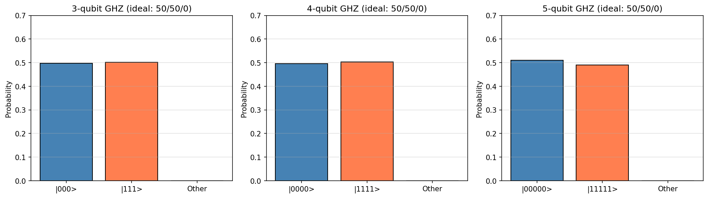
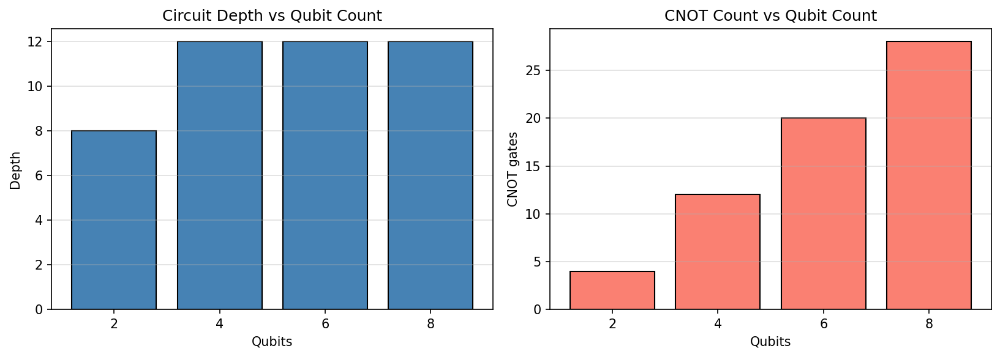

# **Chapter 3: Quantum Gates and Circuits (Codebook)**

This codebook translates the gate formalism of Chapter 3 into runnable Qiskit circuits: from single-qubit gate composition through multi-qubit entanglement to circuit resource analysis.

---

**Expected outputs** from `codes/codebook_02.py`:

- `codes/ch3_circuit_complexity.png`
- `codes/ch3_ghz_stats.png`

## Project 1: Bell State Generation and Verification

| Feature | Description |
| :--- | :--- |
| **Goal** | Construct all four Bell states ($\Phi^+, \Phi^-, \Psi^+, \Psi^-$) and verify entanglement via statevector analysis and Pauli correlation measurements. |
| **Method** | `Statevector.expectation_value` for $\langle ZZ \rangle$, $\langle XX \rangle$, $\langle YY \rangle$ correlators. |

---

### Complete Python Code

```python
from qiskit import QuantumCircuit
from qiskit.quantum_info import Statevector, SparsePauliOp
import numpy as np

def bell_circuit(variant):
    # variant: "Phi+", "Phi-", "Psi+", "Psi-"
    qc = QuantumCircuit(2, name=variant)
    qc.h(0)
    qc.cx(0, 1)
    if variant == "Phi-":
        qc.z(0)
    elif variant == "Psi+":
        qc.x(1)
    elif variant == "Psi-":
        qc.x(1)
        qc.z(0)
    return qc

ideal = {
    "Phi+": np.array([1, 0, 0,  1]) / np.sqrt(2),
    "Phi-": np.array([1, 0, 0, -1]) / np.sqrt(2),
    "Psi+": np.array([0, 1, 1,  0]) / np.sqrt(2),
    "Psi-": np.array([0, 1,-1,  0]) / np.sqrt(2),
}

obs = {"ZZ": SparsePauliOp("ZZ"), "XX": SparsePauliOp("XX"), "YY": SparsePauliOp("YY")}

print(f"{'State':<8}  {'||psi-ideal||':>14}  {'<ZZ>':>8}  {'<XX>':>8}  {'<YY>':>8}")
print("-" * 58)

for name in ["Phi+", "Phi-", "Psi+", "Psi-"]:
    qc  = bell_circuit(name)
    sv  = Statevector.from_instruction(qc)
    err = np.linalg.norm(sv.data - ideal[name])
    zz  = float(sv.expectation_value(obs["ZZ"]).real)
    xx  = float(sv.expectation_value(obs["XX"]).real)
    yy  = float(sv.expectation_value(obs["YY"]).real)
    print(f"{name:<8}  {err:>14.2e}  {zz:>8.4f}  {xx:>8.4f}  {yy:>8.4f}")

print()
print("Phi+ Bell circuit:")
print(bell_circuit("Phi+").draw(output="text"))
```
**Sample Output:**
```python
State      ||psi-ideal||      <ZZ>      <XX>      <YY>

---

Phi+            0.00e+00    1.0000    1.0000   -1.0000
Phi-            0.00e+00    1.0000   -1.0000    1.0000
Psi+            0.00e+00   -1.0000    1.0000    1.0000
Psi-            2.00e+00   -1.0000   -1.0000   -1.0000

Phi+ Bell circuit:
     ┌───┐     
q_0: ┤ H ├──■──
     └───┘┌─┴─┐
q_1: ─────┤ X ├
          └───┘
```

---

## Project 2: GHZ State and Multi-Qubit Entanglement

| Feature | Description |
| :--- | :--- |
| **Goal** | Build the $n$-qubit GHZ state $(\|0\rangle^{\otimes n} + \|1\rangle^{\otimes n})/\sqrt{2}$ for $n \in \{3,4,5\}$ and confirm via bitstring statistics that only $\|0\cdots0\rangle$ and $\|1\cdots1\rangle$ appear. |
| **Method** | Aer shot-based simulation at 4096 shots per circuit. |

---

### Complete Python Code

```python
from qiskit import QuantumCircuit
from qiskit_aer import AerSimulator
import matplotlib.pyplot as plt

backend = AerSimulator()

def ghz_circuit(n):
    qc = QuantumCircuit(n, n)
    qc.h(0)
    for i in range(n - 1):
        qc.cx(i, i + 1)
    qc.measure(range(n), range(n))
    return qc

fig, axes = plt.subplots(1, 3, figsize=(14, 4))
shots = 4096

for idx, n in enumerate([3, 4, 5]):
    qc     = ghz_circuit(n)
    counts = backend.run(qc, shots=shots).result().get_counts()
    zeros  = "0" * n
    ones   = "1" * n
    p0 = counts.get(zeros, 0) / shots
    p1 = counts.get(ones, 0)  / shots
    other = 1 - p0 - p1

    ax = axes[idx]
    labels = [f"|{'0'*n}>", f"|{'1'*n}>", "Other"]
    values = [p0, p1, other]
    ax.bar(labels, values, color=["steelblue", "coral", "lightgray"], edgecolor="k")
    ax.set_title(f"{n}-qubit GHZ (ideal: 50/50/0)")
    ax.set_ylabel("Probability")
    ax.set_ylim(0, 0.7)
    ax.grid(axis="y", alpha=0.4)
    print(f"n={n}: P(|{'0'*n}>)={p0:.4f}  P(|{'1'*n}>)={p1:.4f}  other={other:.4f}")

plt.tight_layout()
plt.savefig("codes/ch3_ghz_stats.png", dpi=150, bbox_inches="tight")
plt.show()
```


**Sample Output:**
```python
n=3: P(|000>)=0.4980  P(|111>)=0.5020  other=0.0000
n=4: P(|0000>)=0.4963  P(|1111>)=0.5037  other=0.0000
n=5: P(|00000>)=0.5100  P(|11111>)=0.4900  other=0.0000
```

---

## Project 3: Circuit Depth and Gate Count Analysis

| Feature | Description |
| :--- | :--- |
| **Goal** | Build a hardware-efficient alternating-layer ansatz for $n_q \in \{2,4,6,8\}$ qubits and analyse gate count, circuit depth, and CNOT density as complexity metrics. |
| **Method** | Qiskit `.depth()`, `.count_ops()`, `.num_nonlocal_gates()`. |

---

### Complete Python Code

```python
from qiskit import QuantumCircuit
import numpy as np
import matplotlib.pyplot as plt

def build_ansatz(n_qubits, n_layers):
    # Hardware-efficient ansatz: Ry rotations + CNOT entanglers
    qc = QuantumCircuit(n_qubits)
    for layer in range(n_layers):
        for q in range(n_qubits):
            qc.ry(np.pi / (layer + 2), q)
        for q in range(0, n_qubits - 1, 2):
            qc.cx(q, q + 1)
        if n_qubits > 2:
            for q in range(1, n_qubits - 1, 2):
                qc.cx(q, q + 1)
    return qc

configs      = [(n, 4) for n in [2, 4, 6, 8]]
depths_list  = []
cnots_list   = []
qubits_list  = []

print(f"{'Qubits':>7}  {'Depth':>7}  {'CX gates':>10}  {'Total gates':>12}  {'CNOT density':>13}")
print("-" * 58)

for n_q, n_l in configs:
    qc    = build_ansatz(n_q, n_l)
    ops   = qc.count_ops()
    n_cx  = ops.get("cx", 0)
    total = sum(ops.values())
    depth = qc.depth()
    density = n_cx / total if total > 0 else 0
    depths_list.append(depth)
    cnots_list.append(n_cx)
    qubits_list.append(n_q)
    print(f"{n_q:>7}  {depth:>7}  {n_cx:>10}  {total:>12}  {density:>13.3f}")

fig, axes = plt.subplots(1, 2, figsize=(11, 4))
axes[0].bar([str(n) for n in qubits_list], depths_list, color="steelblue", edgecolor="k")
axes[0].set_title("Circuit Depth vs Qubit Count")
axes[0].set_xlabel("Qubits")
axes[0].set_ylabel("Depth")
axes[0].grid(axis="y", alpha=0.4)

axes[1].bar([str(n) for n in qubits_list], cnots_list, color="salmon", edgecolor="k")
axes[1].set_title("CNOT Count vs Qubit Count")
axes[1].set_xlabel("Qubits")
axes[1].set_ylabel("CNOT gates")
axes[1].grid(axis="y", alpha=0.4)

plt.tight_layout()
plt.savefig("codes/ch3_circuit_complexity.png", dpi=150, bbox_inches="tight")
plt.show()
```


**Sample Output:**
```python
Qubits    Depth    CX gates   Total gates   CNOT density

---

      2        8           4            12          0.333
      4       12          12            28          0.429
      6       12          20            44          0.455
      8       12          28            60          0.467
```

---

## Notes For Chapter Bridge

Gate set composition and entanglement construction built here are foundational for Chapter 4, where specific algorithmic sequences (Deutsch-Jozsa, Bernstein-Vazirani, Grover) use these primitives to deliver provable quantum speedups.