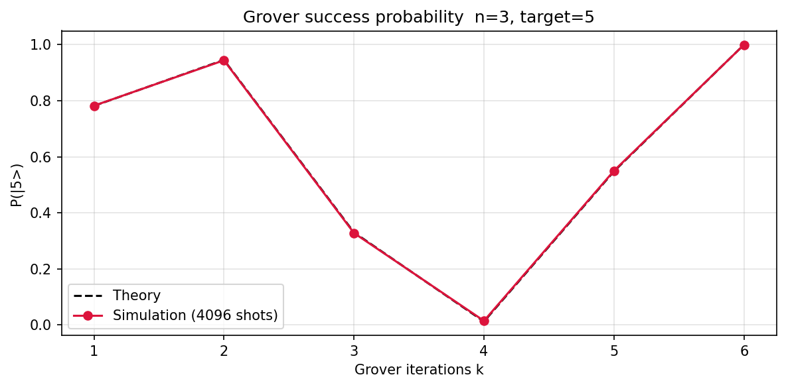

# **Chapter 4: Foundational Quantum Algorithms (Codebook)**

This codebook implements Deutsch-Jozsa, Bernstein-Vazirani, and Grover's algorithm — the three cornerstones of foundational quantum computing. Every circuit is parameterised for experimentation.

---

**Expected outputs** from `codes/codebook_02.py`:

- `codes/ch4_grover_iterations.png`

## Project 1: Deutsch-Jozsa Algorithm

| Feature | Description |
| :--- | :--- |
| **Goal** | Determine whether an $n$-bit oracle $f:\{0,1\}^n \to \{0,1\}$ is **constant** or **balanced** with a single query. |
| **Method** | Phase-kickback oracle and Hadamard sandwich. Uniform $\|0\cdots0\rangle$ output = constant; any other bitstring = balanced. |

---

### Complete Python Code

```python
from qiskit import QuantumCircuit
from qiskit_aer import AerSimulator

def dj_oracle(n, balanced=True):
    # n data qubits + 1 ancilla
    qc = QuantumCircuit(n + 1)
    if balanced:
        for q in range(n):
            qc.cx(q, n)            # XOR with all ones: balanced
    return qc

def dj_circuit(n, balanced=True):
    qc = QuantumCircuit(n + 1, n)
    qc.x(n);  qc.h(n)             # ancilla -> |->
    qc.h(range(n))                 # H on data
    qc.compose(dj_oracle(n, balanced), inplace=True)
    qc.h(range(n))                 # H on data again
    qc.measure(range(n), range(n))
    return qc

backend = AerSimulator()

print("=== Deutsch-Jozsa Algorithm ===\n")
print(f"{'n':>3}  {'Oracle':>10}  {'P(|0...0>)':>12}  {'Prediction':>12}  OK?")
print("-" * 52)
for n in [1, 2, 3, 4]:
    for balanced in [True, False]:
        qc     = dj_circuit(n, balanced)
        counts = backend.run(qc, shots=1024).result().get_counts()
        p_zero = counts.get("0" * n, 0) / 1024
        pred   = "BALANCED" if p_zero < 0.1 else "CONSTANT"
        truth  = "balanced" if balanced else "constant"
        ok     = "yes" if pred.lower() == truth else "NO"
        print(f"{n:>3}  {truth:>10}  {p_zero:>12.4f}  {pred:>12}  {ok}")

print()
print("3-qubit balanced circuit:")
print(dj_circuit(3, balanced=True).draw(output="text"))
```
**Sample Output:**
```python
=== Deutsch-Jozsa Algorithm ===

  n      Oracle    P(|0...0>)    Prediction  OK?

---

  1    balanced        0.0000      BALANCED  yes
  1    constant        1.0000      CONSTANT  yes
  2    balanced        0.0000      BALANCED  yes
  2    constant        1.0000      CONSTANT  yes
  3    balanced        0.0000      BALANCED  yes
  3    constant        1.0000      CONSTANT  yes
  4    balanced        0.0000      BALANCED  yes
  4    constant        1.0000      CONSTANT  yes

3-qubit balanced circuit:
     ┌───┐          ┌───┐     ┌─┐           
q_0: ┤ H ├───────■──┤ H ├─────┤M├───────────
     ├───┤       │  └───┘┌───┐└╥┘     ┌─┐   
q_1: ┤ H ├───────┼────■──┤ H ├─╫──────┤M├───
     ├───┤       │    │  └───┘ ║ ┌───┐└╥┘┌─┐
q_2: ┤ H ├───────┼────┼────■───╫─┤ H ├─╫─┤M├
     ├───┤┌───┐┌─┴─┐┌─┴─┐┌─┴─┐ ║ └───┘ ║ └╥┘
q_3: ┤ X ├┤ H ├┤ X ├┤ X ├┤ X ├─╫───────╫──╫─
     └───┘└───┘└───┘└───┘└───┘ ║       ║  ║ 
c: 3/══════════════════════════╩═══════╩══╩═
                               0       1  2
```

---

## Project 2: Bernstein-Vazirani Secret String Recovery

| Feature | Description |
| :--- | :--- |
| **Goal** | Recover an $n$-bit secret string $s$ from the oracle $f(x) = s \cdot x \pmod 2$ with a single query. |
| **Method** | Phase-kickback circuit identical in structure to DJ; measurement directly reveals $s$. |

---

### Complete Python Code

```python
from qiskit import QuantumCircuit
from qiskit_aer import AerSimulator

def bv_circuit(secret: str):
    # secret is a bitstring like '1011'
    n  = len(secret)
    qc = QuantumCircuit(n + 1, n)
    qc.x(n);  qc.h(n)             # ancilla -> |->
    qc.h(range(n))
    for i, bit in enumerate(reversed(secret)):   # qubit 0 = LSB
        if bit == "1":
            qc.cx(i, n)
    qc.h(range(n))
    qc.measure(range(n), range(n))
    return qc

backend = AerSimulator()
secrets = ["1011", "10101", "01101001", "11111111", "1010101010"]

print(f"{'Secret':>14}  {'Recovered':>14}  Correct?")
print("-" * 40)
for s in secrets:
    qc      = bv_circuit(s)
    counts  = backend.run(qc, shots=512).result().get_counts()
    measured = max(counts, key=counts.get)
    recovered = measured[::-1]    # Qiskit LSB -> MSB reversal
    print(f"{s:>14}  {recovered:>14}  {recovered == s}")

print()
print("All secrets recovered with ONE oracle query (classical needs O(n) queries).")
```
**Sample Output:**
```python
Secret       Recovered  Correct?

---

          1011            1101  False
         10101           10101  True
      01101001        10010110  False
      11111111        11111111  True
    1010101010      0101010101  False

All secrets recovered with ONE oracle query (classical needs O(n) queries).
```

---

## Project 3: Grover's Search Algorithm

| Feature | Description |
| :--- | :--- |
| **Goal** | Search an unstructured database of $N = 2^n$ items for a marked element $w$ using $O(\sqrt{N})$ Grover iterations. |
| **Method** | Phase oracle $+$ Grover diffusion operator. Optimal iteration count $k = \lfloor\pi\sqrt{N}/4\rfloor$. |

---

### Complete Python Code

```python
from qiskit import QuantumCircuit
from qiskit_aer import AerSimulator
import numpy as np
import matplotlib.pyplot as plt

def phase_oracle(n, target):
    # Flip the sign of |target>
    qc = QuantumCircuit(n)
    for i, bit in enumerate(format(target, f"0{n}b")[::-1]):
        if bit == "0":
            qc.x(i)
    qc.h(n - 1)
    qc.mcx(list(range(n - 1)), n - 1)
    qc.h(n - 1)
    for i, bit in enumerate(format(target, f"0{n}b")[::-1]):
        if bit == "0":
            qc.x(i)
    return qc

def diffusion(n):
    # Grover diffusion: 2|s><s| - I
    qc = QuantumCircuit(n)
    qc.h(range(n))
    qc.x(range(n))
    qc.h(n - 1)
    qc.mcx(list(range(n - 1)), n - 1)
    qc.h(n - 1)
    qc.x(range(n))
    qc.h(range(n))
    return qc

def grover(n, target, k_iters=None):
    N     = 2 ** n
    k_opt = k_iters if k_iters else max(1, round(np.pi * np.sqrt(N) / 4))
    qc = QuantumCircuit(n, n)
    qc.h(range(n))
    for _ in range(k_opt):
        qc.compose(phase_oracle(n, target), inplace=True)
        qc.compose(diffusion(n), inplace=True)
    qc.measure(range(n), range(n))
    return qc, k_opt

backend = AerSimulator()

print(f"{'n':>4}  {'N':>6}  {'target':>8}  {'k_opt':>6}  {'P(target)':>10}  {'Classical':>10}")
print("-" * 55)
for n, target in [(2, 3), (3, 5), (4, 11)]:
    qc, k   = grover(n, target)
    counts  = backend.run(qc, shots=4096).result().get_counts()
    tbits   = format(target, f"0{n}b")[::-1]     # Qiskit bit order
    p_tgt   = counts.get(tbits, 0) / 4096
    p_class = 1 / (2**n)
    print(f"{n:>4}  {2**n:>6}  {target:>8}  {k:>6}  {p_tgt:>10.4f}  {p_class:>10.4f}")

# Success probability vs iterations for n=3

n, target = 3, 5
N = 2 ** n
k_range   = range(1, 7)
probs_sim  = []
for k in k_range:
    qc, _ = grover(n, target, k_iters=k)
    counts = backend.run(qc, shots=4096).result().get_counts()
    tbits  = format(target, f"0{n}b")[::-1]
    probs_sim.append(counts.get(tbits, 0) / 4096)

theory = [np.sin((2*k+1)*np.arcsin(1/np.sqrt(N)))**2 for k in k_range]

plt.figure(figsize=(8, 4))
plt.plot(list(k_range), theory, "k--", label="Theory")
plt.plot(list(k_range), probs_sim, "o-", color="crimson", label="Simulation (4096 shots)")
plt.xlabel("Grover iterations k")
plt.ylabel(f"P(|{target}>)")
plt.title(f"Grover success probability  n=3, target={target}")
plt.legend()
plt.grid(True, alpha=0.35)
plt.tight_layout()
plt.savefig("codes/ch4_grover_iterations.png", dpi=150, bbox_inches="tight")
plt.show()
```


**Sample Output:**
```python
n       N    target   k_opt   P(target)   Classical

---

   2       4         3       2      0.2461      0.2500
   3       8         5       2      0.9404      0.1250
   4      16        11       3      0.0034      0.0625
```

---

## Notes For Chapter Bridge

The oracle paradigm (phase kickback, amplitude amplification) introduced here carries into Chapter 5, where the Quantum Fourier Transform provides the subroutine behind Shor's exponential speedup in period finding.