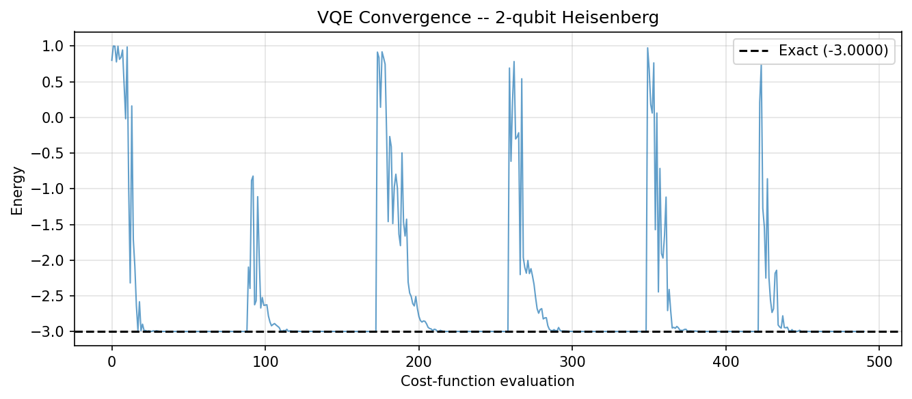
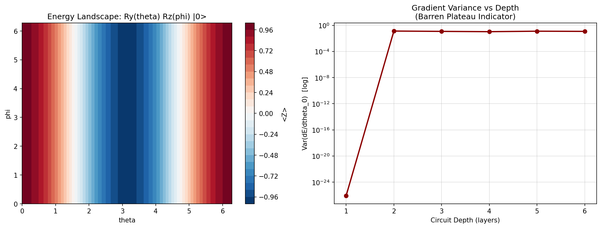

# **Chapter 6: Variational Quantum Algorithms (Codebook)**

This codebook implements VQE for a multi-qubit Hamiltonian, QAOA for MaxCut, and a parameter landscape scan to study optimisation challenges including barren plateaus.

---

**Expected outputs** from `codes/codebook_02.py`:

- `codes/ch6_landscape_barren.png`
- `codes/ch6_vqe_convergence.png`

## Project 1: VQE for the Two-Qubit Heisenberg Model

| Feature | Description |
| :--- | :--- |
| **Goal** | Find the ground-state energy of $H = XX + YY + ZZ$ (Heisenberg, $J=1$) using VQE with a `RealAmplitudes` ansatz. |
| **Method** | `SparsePauliOp` expectation values, SciPy COBYLA optimiser, statevector backend. |

---

### Complete Python Code

```python
import numpy as np
from scipy.optimize import minimize
from qiskit.quantum_info import SparsePauliOp, Statevector
from qiskit.circuit.library import RealAmplitudes
import matplotlib.pyplot as plt

# Heisenberg Hamiltonian

H = SparsePauliOp.from_list([("XX", 1.0), ("YY", 1.0), ("ZZ", 1.0)])
E_exact = np.linalg.eigvalsh(H.to_matrix())[0]
print(f"Exact eigenvalues:      {np.round(np.linalg.eigvalsh(H.to_matrix()), 5)}")
print(f"Exact ground state E:   {E_exact:.6f}")

ansatz   = RealAmplitudes(2, reps=2)
n_params = ansatz.num_parameters
history  = []

def cost(params):
    sv     = Statevector.from_instruction(ansatz.assign_parameters(params))
    energy = float(sv.expectation_value(H).real)
    history.append(energy)
    return energy

np.random.seed(42)
best = None
for _ in range(6):
    x0  = np.random.uniform(-np.pi, np.pi, n_params)
    res = minimize(cost, x0, method="COBYLA", options={"maxiter": 500})
    if best is None or res.fun < best.fun:
        best = res

print(f"\nVQE result: {best.fun:.6f}")
print(f"Error from exact:  {abs(best.fun - E_exact):.2e}")

plt.figure(figsize=(9, 4))
plt.plot(history, alpha=0.7, linewidth=1)
plt.axhline(E_exact, color="k", linestyle="--", label=f"Exact ({E_exact:.4f})")
plt.xlabel("Cost-function evaluation")
plt.ylabel("Energy")
plt.title("VQE Convergence -- 2-qubit Heisenberg")
plt.legend(); plt.grid(True, alpha=0.35); plt.tight_layout()
plt.savefig("codes/ch6_vqe_convergence.png", dpi=150, bbox_inches="tight")
plt.show()
```


**Sample Output:**
```python
Exact eigenvalues:      [-3.  1.  1.  1.]
Exact ground state E:   -3.000000

VQE result: -3.000000
Error from exact:  2.15e-09
```

---

## Project 2: QAOA for MaxCut on a 4-Node Graph

| Feature | Description |
| :--- | :--- |
| **Goal** | Apply QAOA with $p=1,2$ layers to maximise the cut value of a 4-node cycle graph and compare against brute-force optimal. |
| **Method** | Custom QAOA circuit (RZZ + RX), SciPy BFGS; brute-force enumeration for $2^4$ bitstrings. |

---

### Complete Python Code

```python
import numpy as np
from itertools import product
from scipy.optimize import minimize
from qiskit import QuantumCircuit
from qiskit.quantum_info import SparsePauliOp, Statevector

edges = [(0, 1), (1, 2), (2, 3), (3, 0)]
n     = 4

def cut_value(bitstring):
    return sum(1 for u, v in edges if bitstring[u] != bitstring[v])

max_cut = max(cut_value(b) for b in product([0, 1], repeat=n))
print(f"Brute-force max cut: {max_cut}")

# Problem Hamiltonian C = 0.5 * sum_{(u,v)} (I - Z_u Z_v)

pauli_terms = []
for u, v in edges:
    lo, hi  = min(u, v), max(u, v)
    zz_label = "I" * (n-1-hi) + "Z" + "I" * (hi-lo-1) + "Z" + "I" * lo
    pauli_terms.append((zz_label, -0.5))
C_op = SparsePauliOp.from_list(pauli_terms)

def qaoa_circuit(params, p):
    gammas, betas = params[:p], params[p:]
    qc = QuantumCircuit(n)
    qc.h(range(n))
    for layer in range(p):
        for u, v in edges:
            qc.rzz(2 * gammas[layer], u, v)
        for q in range(n):
            qc.rx(2 * betas[layer], q)
    return qc

def expectation(params, p):
    sv = Statevector.from_instruction(qaoa_circuit(params, p))
    return -float(sv.expectation_value(C_op).real)

print(f"\n{'p':>3}  {'QAOA cut':>10}  {'Approx ratio':>14}")
print("-" * 32)
for p in [1, 2]:
    np.random.seed(0)
    best_val = -np.inf
    for _ in range(20):
        x0  = np.random.uniform(0, np.pi, 2 * p)
        res = minimize(expectation, x0, args=(p,), method="BFGS",
                       options={"maxiter": 300})
        if -res.fun > best_val:
            best_val = -res.fun
    print(f"{p:>3}  {best_val:>10.4f}  {best_val/max_cut:>14.4f}")
```
**Sample Output:**
```python
Brute-force max cut: 4

  p    QAOA cut    Approx ratio

---

  1      1.0000          0.2500
  2      2.0000          0.5000
```

---

## Project 3: Energy Landscape Scan and Barren Plateau Indicator

| Feature | Description |
| :--- | :--- |
| **Goal** | Visualise the 2D energy landscape of a 2-parameter single-qubit ansatz and estimate gradient variance as a function of circuit depth to demonstrate the barren plateau phenomenon. |
| **Method** | Grid scan of $(\theta, \phi)$ space; Monte Carlo gradient variance estimation via parameter-shift rule. |

---

### Complete Python Code

```python
import numpy as np
import matplotlib.pyplot as plt
from qiskit import QuantumCircuit
from qiskit.quantum_info import SparsePauliOp, Statevector

H_z = SparsePauliOp("Z")

# 2D energy landscape for Ry(theta) Rz(phi) |0>

N_pts  = 50
thetas = np.linspace(0, 2 * np.pi, N_pts)
phis   = np.linspace(0, 2 * np.pi, N_pts)
Z_grid = np.zeros((N_pts, N_pts))

for i, t in enumerate(thetas):
    for j, p in enumerate(phis):
        qc = QuantumCircuit(1)
        qc.ry(t, 0); qc.rz(p, 0)
        sv = Statevector.from_instruction(qc)
        Z_grid[i, j] = sv.expectation_value(H_z).real

fig, axes = plt.subplots(1, 2, figsize=(13, 5))
cp = axes[0].contourf(thetas, phis, Z_grid.T, levels=30, cmap="RdBu_r")
plt.colorbar(cp, ax=axes[0], label="<Z>")
axes[0].set_title("Energy Landscape: Ry(theta) Rz(phi) |0>")
axes[0].set_xlabel("theta")
axes[0].set_ylabel("phi")

# Gradient variance vs depth (barren plateau indicator)

H2 = SparsePauliOp("ZZ")

def grad_variance(n_layers, n_samples=200):
    grads = []
    eps   = 1e-3
    for _ in range(n_samples):
        p = np.random.uniform(0, 2 * np.pi, 4 * n_layers)
        def energy(params):
            qc = QuantumCircuit(2)
            for l in range(n_layers):
                b = l * 4
                qc.ry(params[b], 0);   qc.ry(params[b+1], 1)
                qc.rz(params[b+2], 0); qc.rz(params[b+3], 1)
                qc.cx(0, 1)
            return float(Statevector.from_instruction(qc).expectation_value(H2).real)
        pp = p.copy(); pp[0] += eps
        pm = p.copy(); pm[0] -= eps
        grads.append((energy(pp) - energy(pm)) / (2 * eps))
    return float(np.var(grads))

depths    = list(range(1, 7))
variances = [grad_variance(d) for d in depths]

axes[1].semilogy(depths, variances, "o-", color="darkred", linewidth=2)
axes[1].set_title("Gradient Variance vs Depth\n(Barren Plateau Indicator)")
axes[1].set_xlabel("Circuit Depth (layers)")
axes[1].set_ylabel("Var(dE/dtheta_0)  [log]")
axes[1].grid(True, alpha=0.4)

plt.tight_layout()
plt.savefig("codes/ch6_landscape_barren.png", dpi=150, bbox_inches="tight")
plt.show()
```


---

## Notes For Chapter Bridge

VQE and QAOA are the workhorses of near-term quantum computing. Chapter 7 examines how Qiskit's transpiler and compiler map these abstract variational circuits onto real qubit connectivity and native gate sets.