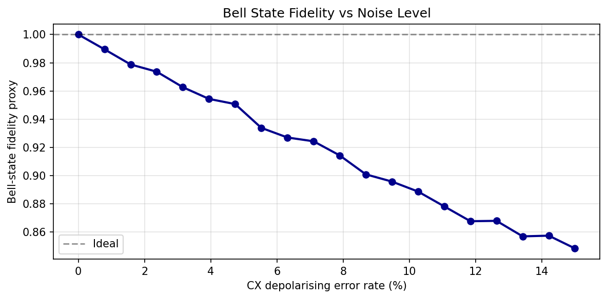

# **Chapter 7: Qiskit — The Universal Quantum Compiler (Codebook)**

This codebook demonstrates Qiskit's transpiler, noise modelling, and pass manager pipeline. Three projects cover basis gate decomposition, noise-fidelity degradation, and custom optimisation passes.

---

**Expected outputs** from `codes/codebook_02.py`:

- `codes/ch7_fidelity_vs_noise.png`

## Project 1: Transpilation and Basis Gate Decomposition

| Feature | Description |
| :--- | :--- |
| **Goal** | Transpile a 3-qubit GHZ circuit to multiple native gate sets and compare gate counts, circuit depths, and CNOT counts across optimisation levels 0–3. |
| **Method** | `qiskit.compiler.transpile` with custom `basis_gates`; `.count_ops()` analysis. |

---

### Complete Python Code

```python
from qiskit import QuantumCircuit, transpile

def ghz3():
    qc = QuantumCircuit(3, 3)
    qc.h(0); qc.cx(0, 1); qc.cx(1, 2)
    qc.measure(range(3), range(3))
    return qc

original = ghz3()

gate_sets = {
    "Original":      None,
    "CX + U3":       ["cx", "u3"],
    "ECR+RZ+SX+X":   ["ecr", "rz", "sx", "x"],
    "CX+RZ+SX+X":    ["cx", "rz", "sx", "x"],
}

print(f"{'Gate set':<22}  {'Depth':>7}  {'Total':>7}  Ops")
print("-" * 70)
for name, basis in gate_sets.items():
    qc_t = original if basis is None else transpile(
        original, basis_gates=basis, optimization_level=1)
    ops   = qc_t.count_ops()
    total = sum(ops.values())
    print(f"{name:<22}  {qc_t.depth():>7}  {total:>7}  {dict(ops)}")

print("\nOptimisation level sweepover (basis: CX+RZ+SX+X):")
print(f"{'Opt level':>10}  {'Depth':>7}  {'CX count':>10}")
print("-" * 32)
for opt in [0, 1, 2, 3]:
    qc_t = transpile(original, basis_gates=["cx", "rz", "sx", "x"],
                     optimization_level=opt)
    ops  = qc_t.count_ops()
    print(f"{opt:>10}  {qc_t.depth():>7}  {ops.get('cx', 0):>10}")
```
**Sample Output:**
```python
Gate set                  Depth    Total  Ops

---

Original                      4        6  {'measure': 3, 'cx': 2, 'h': 1}
CX + U3                       4        6  {'measure': 3, 'cx': 2, 'u3': 1}
ECR+RZ+SX+X                   8       16  {'rz': 6, 'sx': 3, 'measure': 3, 'ecr': 2, 'x': 2}
CX+RZ+SX+X                    6        8  {'measure': 3, 'rz': 2, 'cx': 2, 'sx': 1}

Optimisation level sweepover (basis: CX+RZ+SX+X):
 Opt level    Depth    CX count

---

         0        6           2
         1        6           2
         2        6           2
         3        6           2
```

---

## Project 2: Custom Noise Model and Fidelity Degradation

| Feature | Description |
| :--- | :--- |
| **Goal** | Model depolarising noise on CX gates and readout errors; measure Bell-state fidelity degradation as the error rate increases from 0% to 15%. |
| **Method** | `qiskit_aer.noise.NoiseModel` with `depolarizing_error` and `ReadoutError`; fidelity proxy from $P(\|00\rangle) + P(\|11\rangle)$. |

---

### Complete Python Code

```python
import numpy as np
import matplotlib.pyplot as plt
from qiskit import QuantumCircuit
from qiskit_aer import AerSimulator
from qiskit_aer.noise import NoiseModel, depolarizing_error, ReadoutError

def bell_circuit():
    qc = QuantumCircuit(2, 2)
    qc.h(0); qc.cx(0, 1)
    qc.measure([0, 1], [0, 1])
    return qc

def make_noise_model(cx_err, ro_err):
    nm = NoiseModel()
    nm.add_all_qubit_quantum_error(depolarizing_error(cx_err, 2), ["cx"])
    ro = ReadoutError([[1 - ro_err, ro_err], [ro_err, 1 - ro_err]])
    nm.add_all_qubit_readout_error(ro)
    return nm

error_rates = np.linspace(0, 0.15, 20)
fidelities  = []
qc = bell_circuit()
backend = AerSimulator()
shots   = 4096

for err in error_rates:
    nm  = make_noise_model(cx_err=err, ro_err=err / 3)
    counts = backend.run(qc, noise_model=nm, shots=shots).result().get_counts()
    f   = (counts.get("00", 0) + counts.get("11", 0)) / shots
    fidelities.append(f)

plt.figure(figsize=(8, 4))
plt.plot(error_rates * 100, fidelities, "o-", color="darkblue", linewidth=2)
plt.axhline(1.0, color="k", linestyle="--", alpha=0.4, label="Ideal")
plt.xlabel("CX depolarising error rate (%)")
plt.ylabel("Bell-state fidelity proxy")
plt.title("Bell State Fidelity vs Noise Level")
plt.legend(); plt.grid(True, alpha=0.35); plt.tight_layout()
plt.savefig("codes/ch7_fidelity_vs_noise.png", dpi=150, bbox_inches="tight")
plt.show()

print(f"Ideal fidelity (0% error):  {fidelities[0]:.4f}")
print(f"Fidelity at ~5%  error:     {fidelities[6]:.4f}")
print(f"Fidelity at ~15% error:     {fidelities[-1]:.4f}")
```


**Sample Output:**
```python
Ideal fidelity (0% error):  1.0000
Fidelity at ~5%  error:     0.9507
Fidelity at ~15% error:     0.8484
```

---

## Project 3: Pass Manager and Circuit Depth Reduction

| Feature | Description |
| :--- | :--- |
| **Goal** | Apply Qiskit's `PassManager` with `CXCancellation` and single-qubit optimisation passes to reduce the redundant gate count of an artificially deep circuit. |
| **Method** | `CXCancellation`, `Optimize1qGates`, `CommutativeCancellation` pass objects. |

---

### Complete Python Code

```python
from qiskit import QuantumCircuit
from qiskit.transpiler import PassManager
from qiskit.transpiler.passes import (
    CXCancellation,
    CommutationAnalysis,
    CommutativeCancellation,
    Optimize1qGates,
)

def redundant_circuit(n=4):
    # Intentionally redundant: CNOT pairs cancel, RZ over-rotations consolidate
    qc = QuantumCircuit(n)
    for _ in range(3):
        for i in range(n - 1):
            qc.cx(i, i + 1)
        for i in range(n - 1):
            qc.cx(i, i + 1)       # cancels previous pair
    for q in range(n):
        qc.rz(0.1, q)
        qc.rz(0.1, q)
        qc.rz(0.1, q)             # 3x RZ(0.1) = RZ(0.3)
    return qc

qc_orig = redundant_circuit()

pm_cx   = PassManager([CXCancellation()])
pm_1q   = PassManager([Optimize1qGates()])
pm_full = PassManager([
    CXCancellation(),
    CommutationAnalysis(),
    CommutativeCancellation(),
    Optimize1qGates(),
])

circuits = {
    "Original":             qc_orig,
    "CXCancellation only":  pm_cx.run(qc_orig),
    "1q optimisation only": pm_1q.run(qc_orig),
    "Full pass manager":    pm_full.run(qc_orig),
}

print(f"{'Pass manager':<26}  {'Depth':>7}  {'CX gates':>9}  {'Total gates':>12}")
print("-" * 60)
for name, qc in circuits.items():
    ops   = qc.count_ops()
    total = sum(ops.values())
    cx    = ops.get("cx", 0)
    print(f"{name:<26}  {qc.depth():>7}  {cx:>9}  {total:>12}")

print("\nOriginal 3-qubit circuit (showing redundancy):")
print(redundant_circuit(3).draw(output="text"))
```

---

## Notes For Chapter Bridge

The transpiler and noise model tools mastered here become essential in Chapters 8 onward, where quantum machine learning circuits must be compiled efficiently onto noisy backends for practical inference tasks.