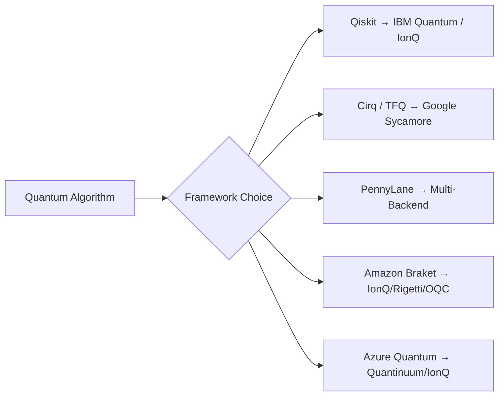

# **Chapter 7: Quantum Tools**

---

# **Introduction**

The practical realisation of quantum algorithms requires not just mathematical insight but a rich software ecosystem that bridges the abstract formalism of quantum mechanics and the physical constraints of quantum hardware. **Quantum programming frameworks** are the indispensable infrastructure of this bridge — they expose circuit-level primitives, enforce hardware connectivity constraints, model gate noise, and interface with cloud quantum processors via unified APIs. Without such frameworks, each hardware vendor would demand bespoke low-level control code, making large-scale quantum software development intractable and non-portable.

This chapter surveys the leading quantum software tools available today. We begin with **Qiskit** — IBM's open-source SDK and the most widely adopted quantum development kit — examining its transpiler pipeline, pass manager, and backend abstractions. We then turn to Google's **Cirq** and its machine-learning-focused extension **TensorFlow Quantum (TFQ)**, which tightly integrates quantum circuits with automatic differentiation. Next, we explore **PennyLane**, Xanadu's differentiable quantum programming library that enables gradient computation through quantum circuits via the parameter-shift rule. The chapter closes by surveying specialised platforms — including Amazon Braket, IonQ's cloud service, and Azure Quantum — that provide vendor-neutral access to trapped-ion, photonic, and superconducting hardware. Together, these tools define the programming model of the NISQ era and constitute the foundational skill-set for every quantum software practitioner [1, 2].

---

# **Chapter 7: Outline**

| **Sec.** | **Title** | **Core Ideas & Examples** |
| :--- | :--- | :--- |
| **7.1** | Qiskit: The Universal Quantum Compiler | Transpiler stages, basis gates, OptimisationLevel, PassManager, GHZ circuit benchmarks |
| **7.2** | Cirq and TensorFlow Quantum | Google's circuit model, Cirq ops, TFQ layers, hybrid gradients for QML |
| **7.3** | PennyLane and Differentiable Programming | Devices, QNodes, parameter-shift rule, JAX/PyTorch integration |
| **7.4** | Specialised & Cloud Platforms | Amazon Braket, Azure Quantum, IonQ, Quantinuum, vendor comparison |

---

## **7.1 Qiskit: The Universal Quantum Compiler**

---

**Qiskit** is IBM's open-source quantum development kit and the de-facto industry standard for quantum circuit construction, simulation, and hardware execution. At its core, Qiskit provides four layers of abstraction: **Terra** (circuit building and transpilation), **Aer** (high-performance classical simulation), **Runtime** (cloud-execution service), and an expanding set of application libraries. This section focuses on the transpiler — Qiskit's most powerful and often underused component.

!!! tip "Why Transpilation Matters"
    Real quantum hardware only supports a sparse native gate set (e.g., `{CX, RZ, SX, X}`) and a fixed qubit-connectivity graph. The transpiler translates any logical circuit into this restricted form while minimising circuit depth and gate count — directly impacting fidelity on noisy hardware.
    
### **The Transpiler Pipeline**

---

Qiskit's transpiler is a multi-stage optimization pipeline exposed through `qiskit.compiler.transpile()`. Each stage applies a sequence of **transformation passes** to the circuit's intermediate representation (IR):

```python
Logical Circuit → Unroll → Translate → Layout → Routing → Optimise → Schedule
```

**Key stages:**

| Stage | Purpose | Example Pass |
| :--- | :--- | :--- |
| **Unroll** | Expand custom gates to primitive ops | `UnrollCustomDefinitions` |
| **Translate** | Map gates to target basis | `BasisTranslator` |
| **Layout** | Assign logical qubits to physical qubits | `DenseLayout`, `SabreLayout` |
| **Routing** | Insert SWAP gates for connectivity | `SabreSwap`, `StochasticSwap` |
| **Optimise** | Cancel redundant gates | `CommutativeCancellation`, `Optimize1qGates` |

The `optimization_level` parameter (0–3) controls the aggressiveness of each stage:

$$
\text{depth}(L=3) \leq \text{depth}(L=2) \leq \text{depth}(L=1) \leq \text{depth}(L=0)
$$

Higher levels invoke more expensive heuristics (like SABRE for routing) but produce shallower circuits better suited to noise-limited hardware.

!!! example "GHZ Circuit Transpilation"
    A 3-qubit GHZ state $|\text{GHZ}\rangle = \tfrac{1}{\sqrt{2}}(|000\rangle + |111\rangle)$ uses one Hadamard and two CNOTs logically. After transpilation to `{CX, RZ, SX, X}` at level 1, the depth becomes 6 and gate count rises to 8 due to basis decomposition — but CNOT count stays at 2, preserving entanglement structure.
    
??? question "Why does CNOT count matter more than total gate count on real hardware?"
    Two-qubit gates (CNOTs) have dramatically higher error rates (~1%) compared to single-qubit gates (~0.1%) on superconducting platforms. Minimising CNOT count therefore has a much larger impact on circuit fidelity than reducing single-qubit gate counts.
    
### **Pass Manager and Custom Passes**

---

For fine-grained control, Qiskit exposes a `PassManager` that lets developers compose any ordered sequence of transformation passes:

```python
from qiskit.transpiler import PassManager
from qiskit.transpiler.passes import CommutativeCancellation, Optimize1qGatesDecomposition

pm = PassManager([
    Optimize1qGatesDecomposition(),
    CommutativeCancellation(),
])
optimised_qc = pm.run(my_circuit)
```

Custom passes can be written by subclassing `TransformationPass` or `AnalysisPass`, enabling domain-specific optimisations such as gate fusion for variational algorithms or qubit permutation for error-mitigation protocols.

!!! tip "SabreLayout for Connectivity-Aware Placement"
    The SABRE (Swap-based Bidirectional heuristic search for Efficient quantum circuit Routing) algorithm finds qubit layouts that minimise SWAP insertion cost. Using `layout_method='sabre'` at optimization level 2 typically reduces SWAP overhead by 20–40% versus the default dense layout.
    
---

## **7.2 Cirq and TensorFlow Quantum**

---

**Cirq** is Google's open-source framework for writing, simulating, and running quantum programs on Google's Sycamore processors. Unlike Qiskit's gate-level API, Cirq is notable for its **moment-based circuit representation**: circuits are collections of *moments* — discrete time steps containing simultaneously executable gates — which maps directly onto the physical execution model of gate-based hardware.

### **Cirq Circuit Model**

---

In Cirq, circuits are built from `cirq.Qubit` objects, operations, and moments:

```python
import cirq

q0, q1, q2 = cirq.LineQubit.range(3)
circuit = cirq.Circuit([
    cirq.H(q0),
    cirq.CNOT(q0, q1),
    cirq.CNOT(q1, q2),
    cirq.measure(q0, q1, q2, key='result')
])
```

Cirq's native gate set maps well to Google's processor, which natively supports `{CZ, √X, Rz, Phased-X}`. The `cirq.google.optimized_for_sycamore()` function applies device-specific compilation passes analogous to Qiskit's transpiler.

$$
|\text{GHZ}\rangle = \frac{1}{\sqrt{2}}\left(|000\rangle + |111\rangle\right) = (H \otimes I \otimes I)\text{CNOT}_{01}\text{CNOT}_{12}|000\rangle
$$

!!! tip "Moment-Based Circuit Representation"
    By explicitly encoding time steps, Cirq makes circuit scheduling transparent: two gates in the same moment execute simultaneously. This enables precise control over parallelism and is essential for advanced error-mitigation techniques that require deterministic execution schedules.
    
### **TensorFlow Quantum (TFQ)**

---

**TensorFlow Quantum** extends Cirq with tight integration into the TensorFlow machine learning ecosystem. TFQ adds three key capabilities:

1. **Quantum data encoding** — convert quantum states or measurement outcomes into TensorFlow tensors
2. **Differentiable quantum layers** — `tfq.layers.PQC` wraps a parameterised Cirq circuit as a Keras layer with gradient support via parameter-shift or finite-difference rules
3. **Batch execution** — simultaneously simulate multiple circuit instances with different parameter settings, critical for mini-batch QML training

```python
import tensorflow_quantum as tfq
import tensorflow as tf

model = tf.keras.Sequential([
    tf.keras.layers.Input(shape=(), dtype=tf.string),
    tfq.layers.PQC(my_circuit, my_observables),
    tf.keras.layers.Dense(2, activation='softmax')
])
```

!!! example "Hybrid Quantum-Classical Training with TFQ"
    A typical TFQ workflow: classical preprocessing → feature encoding into Cirq circuit parameters → quantum expectation value computation → classical classification head. TensorFlow's autodiff handles gradients through the entire hybrid model via TFQ's parameter-shift layer.
    
??? question "What is the advantage of TFQ over a standalone Cirq simulator for QML?"
    TFQ batches thousands of circuit evaluations in a single GPU kernel call, making it orders of magnitude faster than sequential Cirq simulations for training variational classifiers. It also handles the gradient computation automatically within TensorFlow's computation graph.
    
---

## **7.3 PennyLane and Differentiable Programming**

---

**PennyLane** (by Xanadu) was designed from the ground up as a **differentiable quantum programming** library. Its central innovation is the **QNode** — a quantum function that behaves like a Python callable and supports automatic differentiation through classical ML frameworks (PyTorch, JAX, TensorFlow).

### **Devices and QNodes**

---

PennyLane's device abstraction allows the same circuit code to run on diverse backends:

```python
import pennylane as qml
import numpy as np

dev = qml.device("default.qubit", wires=2)

@qml.qnode(dev)
def circuit(theta):
    qml.RY(theta, wires=0)
    qml.CNOT(wires=[0, 1])
    return qml.expval(qml.PauliZ(0))
```

Available devices include `default.qubit` (pure-state simulation), `default.mixed` (density matrix), `qiskit.aer` (via plugin), `lightning.qubit` (C++-accelerated), and hardware backends via cloud plugins.

### **The Parameter-Shift Rule**

---

PennyLane's gradient engine implements the **parameter-shift rule**, which computes exact quantum gradients without finite-difference approximations:

$$
\frac{\partial \langle \hat{O} \rangle}{\partial \theta} = \frac{1}{2}\left[\langle \hat{O} \rangle_{\theta + \pi/2} - \langle \hat{O} \rangle_{\theta - \pi/2}\right]
$$

This rule applies to any gate of the form $U(\theta) = e^{-i\theta G}$ where $G$ is a generator with eigenvalues $\pm 1/2$. Since the gradient is computed from two circuit evaluations (shifted by $\pm\pi/2$), it is **hardware-compatible** — no access to internal circuit states is required.

!!! tip "Exact Gradients on Real Hardware"
    Unlike finite-difference methods ($\nabla \approx \frac{f(\theta+\epsilon)-f(\theta)}{\epsilon}$), parameter-shift gradients are exact (up to shot noise) and require only two circuit evaluations per parameter. This makes PennyLane uniquely suited for gradient-based optimization directly on quantum hardware.
    
!!! example "VQC Gradient with PyTorch Autodiff"
        ```python
        import torch
        dev = qml.device("default.qubit", wires=1)
        
        @qml.qnode(dev, interface="torch", diff_method="parameter-shift")
        def circuit(theta):
            qml.RY(theta, wires=0)
            return qml.expval(qml.PauliZ(0))
        
        theta = torch.tensor(0.5, requires_grad=True)
        loss = circuit(theta)
        loss.backward()
        print(theta.grad)  # exact gradient via parameter-shift
    
### **Plugin Ecosystem**

---

PennyLane's extensibility is enabled by a plugin architecture that wraps third-party backends as PennyLane devices. Notable plugins include `pennylane-qiskit` (IBM hardware), `pennylane-braket` (AWS backend), and `pennylane-lightning-gpu` (GPU-accelerated simulation). This write-once, run-anywhere model is PennyLane's defining advantage for algorithm development and benchmarking.

??? question "Can PennyLane be used for classical deep learning tasks?"
    Yes — PennyLane circuits can be embedded as layers inside standard PyTorch or Keras models, enabling true hybrid architectures where quantum layers and classical layers share the same gradient tape. This is particularly useful for quantum transfer learning, where a pretrained classical CNN is extended with a small quantum layer.
    
---

## **7.4 Specialised & Cloud Platforms**

---

Beyond the three major open-source frameworks above, the quantum computing landscape includes several specialised platforms that offer unique hardware access or domain-specific abstractions. These cloud services democratise access to cutting-edge quantum processors without requiring physical lab infrastructure.



### **Amazon Braket**

---

Amazon Braket provides a unified Python SDK and managed notebooks for accessing multiple hardware providers:
- **IonQ** — trapped-ion processor (up to 25 qubits, all-to-all connectivity)
- **Rigetti** — superconducting chip (Ankaa series)
- **OQC** — Oxford Quantum Circuits (Lucy device)

The Braket SDK mirrors Qiskit's circuit API and supports `LocalSimulator`, `StateVectorSimulator`, and hardware jobs through `AwsDevice`.

### **Azure Quantum and IonQ / Quantinuum**

---

Microsoft's Azure Quantum aggregates access to **IonQ** (trapped ion) and **Quantinuum** (formerly Cambridge Quantum / Honeywell) hardware. Azure Quantum also features Q# — Microsoft's domain-specific quantum language — with classical control flow, classical-quantum interop, and resource estimation via the Azure Quantum Resource Estimator.

**Quantinuum's H2-1 processor** (32 trapped-ion qubits, all-to-all connectivity) achieves the industry's best published two-qubit gate fidelities (~99.8%), making it the preferred hardware for small-depth, high-fidelity algorithm testing [3].

!!! tip "Choosing a Platform"
    Use Qiskit + IBM for broad ecosystem support and abundant free cloud credits; use PennyLane when gradient-based optimisation or framework interoperability is the priority; use IonQ/Quantinuum via Braket or Azure when native high-fidelity two-qubit gates matter more than qubit count.
    
!!! example "Cross-Platform Portability"
    The same Bell-pair circuit can be run on four different backends by simply swapping device strings — `"default.qubit"` (PennyLane simulation), `"qiskit.aer"` (noise simulation), `"braket.local.qubit"` (Braket local), and `"braket.aws.qubit"` (real hardware) — with no algorithm-level code changes.
    
??? question "What is the main connectivity advantage of trapped-ion computers over superconducting chips?"
    Trapped-ion qubits are connected via laser-mediated phonon interactions, giving **all-to-all connectivity** — any two qubit in the register can interact directly without SWAP routing. Superconducting chips typically have sparse nearest-neighbour graphs (e.g., IBM's heavy-hex lattice), which require additional SWAP gates for non-adjacent qubit interactions and increase effective circuit depth.
    
---

## **References**

[1] Aleksandrowicz, G., et al. (2019). *Qiskit: An Open-source Framework for Quantum Computing*. Zenodo. https://doi.org/10.5281/zenodo.2562110

[2] Broughton, M., et al. (2020). *TensorFlow Quantum: A Software Framework for Quantum Machine Learning*. arXiv:2003.02989.

[3] Quantinuum. (2023). *System Model H2: Product Data Sheet*. https://www.quantinuum.com