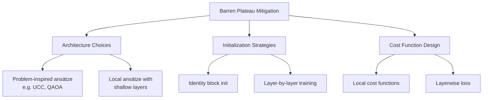

# **Chapter 15: Differentiable Quantum Programming**

---

# **Introduction**

The fusion of quantum computing with machine learning demands more than placing a quantum circuit inside a training loop — it requires **differentiating through quantum operations** with the same ease that PyTorch differentiates through neural network layers. **Differentiable quantum programming** (DQP) provides exactly this capability: a mathematical and software framework that treats parameterised quantum circuits as smooth, differentiable functions of their parameters, enabling gradient-based optimization on quantum hardware and simulators alike.

The key insight of DQP is the **parameter-shift rule**: an exact finite-difference formula for quantum circuit gradients that requires only circuit evaluations at shifted parameter values, making gradient computation hardware-compatible without access to internal quantum states. This is philosophically different from classical autodiff (which needs access to intermediate activations) and enables the same optimizers used in deep learning — Adam, BFGS, natural gradient descent — to train quantum models directly on noisy hardware.

This chapter builds a rigorous understanding of differentiable quantum programming. We explore the parameter-shift rule and its derivation, examine the **quantum natural gradient** and its relationship to the quantum Fisher information matrix, analyse **barren plateaus** (the quantum equivalent of vanishing gradients) and mitigation strategies, and survey leading DQP frameworks: PennyLane, TFQ, and Qiskit Machine Learning. The chapter also connects DQP to variational algorithms (VQE, QAOA) studied in Chapters 5–6, showing that those algorithms are special cases of the broader DQP paradigm [1, 2].

---

# **Chapter 15: Outline**

| **Sec.** | **Title** | **Core Ideas & Examples** |
| :--- | :--- | :--- |
| **15.1** | PennyLane for Differentiable QML | QNodes, device abstraction, PyTorch/JAX interface, gradient transforms |
| **15.2** | TFQ and Qiskit Machine Learning | TFQ PQC layers, Qiskit's SamplerQNN and EstimatorQNN, hybrid Keras integration |
| **15.3** | Training Strategies and Barren Plateaus | Parameter-shift rule, natural gradient, barren plateau diagnosis and mitigation |

---

## **15.1 PennyLane for Differentiable QML**

---

**PennyLane** is Xanadu's differentiable quantum programming library and the most feature-complete toolkit for gradient-based quantum machine learning. Its unifying abstraction is the **QNode** (quantum node) — a Python function wrapping a quantum circuit that supports automatic differentiation through the same interfaces as standard ML frameworks.

### **QNodes and the Device Abstraction**

---

A QNode is declared by decorating a quantum function with `@qml.qnode(device)`:

```python
import pennylane as qml
import numpy as np

dev = qml.device("default.qubit", wires=4)

@qml.qnode(dev, diff_method="parameter-shift")
def vqc(params):
    for i in range(4):
        qml.RY(params[i], wires=i)
    qml.broadcast(qml.CNOT, wires=range(4), pattern="chain")
    return qml.expval(qml.PauliZ(0) @ qml.PauliZ(3))
```

The `diff_method` argument selects the gradient computation strategy:

| Method | Formula | Hardware-compatible? |
| :--- | :--- | :--- |
| `parameter-shift` | Exact two-point shift formula | ✅ Yes |
| `finite-diff` | Numerical approximation | ✅ Yes |
| `backprop` | Classical autodiff (simulation only) | ❌ No |
| `adjoint` | Adjoint differentiation (simulator) | ❌ No |

!!! tip "Choose `parameter-shift` for Hardware Runs"
```
Only `parameter-shift` and `finite-diff` work on real quantum backends, since they only require standard circuit measurements. `backprop` and `adjoint` require access to the simulator's internal state vector.

```
### **Gradient Transforms and Higher-Order Derivatives**

---

PennyLane's `qml.grad` and `qml.jacobian` compute first-order gradients, while `qml.hessian` computes second-order partial derivatives — all via the parameter-shift rule applied recursively:

$$
\frac{\partial^2 \langle \hat{O} \rangle}{\partial \theta_i \partial \theta_j} = \frac{1}{4}\left[\langle \hat{O} \rangle_{\theta_{ij}^{++}} - \langle \hat{O} \rangle_{\theta_{ij}^{+-}} - \langle \hat{O} \rangle_{\theta_{ij}^{-+}} + \langle \hat{O} \rangle_{\theta_{ij}^{--}}\right]
$$

where $\theta_{ij}^{++}$ shifts both $\theta_i$ and $\theta_j$ by $+\pi/2$. Higher-order derivatives scale as $4^k$ circuit evaluations for $k$-th order, so they are used sparingly.

!!! example "Gradient Descent on a VQC with PennyLane"
    ```python
    # 4-parameter VQC trained to maximise ZZ correlation
    params = np.random.uniform(-np.pi, np.pi, 4)
    opt = qml.AdamOptimizer(stepsize=0.1)
    
    for step in range(100):
        params, cost = opt.step_and_cost(lambda p: -vqc(p), params)
        if step % 20 == 0:
            print(f"Step {step}: cost = {-cost:.4f}")
    ```

??? question "Why does PennyLane support JAX as a backend?"
```
JAX provides JIT compilation (via XLA) and GPU/TPU acceleration. PennyLane QNodes declared with `interface='jax'` can be JIT-compiled with `jax.jit`, batched with `jax.vmap`, and differentiated with `jax.grad` — enabling quantum circuits to run with the same efficiency as classical JAX models on accelerators.

```
---

## **15.2 TFQ and Qiskit Machine Learning**

---

### **TensorFlow Quantum (TFQ)**

---

TFQ integrates Cirq circuits into the TensorFlow computation graph, enabling quantum circuits to be used as differentiable Keras layers. The central component is `tfq.layers.PQC` (Parameterised Quantum Circuit layer):

```python
import tensorflow_quantum as tfq
import cirq, sympy, tensorflow as tf

# Build a parameterised Cirq circuit
q0, q1 = cirq.GridQubit.rect(1, 2)
theta = sympy.Symbol('theta')
pqc_circuit = cirq.Circuit(cirq.ry(theta)(q0), cirq.CNOT(q0, q1))

# Wrap as Keras layer
pqc_layer = tfq.layers.PQC(pqc_circuit, cirq.Z(q0))

# Use in a hybrid model
model = tf.keras.Sequential([
    tf.keras.layers.Dense(1, activation='tanh'),       # classical pre-processing
    pqc_layer,                                          # quantum layer
    tf.keras.layers.Dense(2, activation='softmax'),    # classical classification
])
```

TFQ also provides `tfq.layers.Expectation` and `tfq.layers.Sample` for flexible measurement strategies, and `tfq.layers.ControlledPQC` for data re-uploading architectures.

!!! tip "Data Re-Uploading in TFQ"
```
In the **data re-uploading** model, classical input features $\vec{x}$ are injected into the circuit multiple times as gate rotation angles — interleaved with trainable parameters. TFQ's `ControlledPQC` layer enables this pattern natively, allowing the circuit to act as a universal classifier even with a single qubit.

```
### **Qiskit Machine Learning**

---

IBM's Qiskit Machine Learning library provides PyTorch- and Scikit-learn-compatible neural network building blocks:

- **`EstimatorQNN`** — wraps a parameterised circuit + observable, computes expectation value gradients using the parameter-shift rule via Qiskit's Estimator primitive
- **`SamplerQNN`** — wraps a circuit + measurement, computes gradients of measurement probability distribution
- **`QNNClassifier` / `QNNRegressor`** — Scikit-learn estimator wrappers

```python
from qiskit_machine_learning.neural_networks import EstimatorQNN
from qiskit_machine_learning.algorithms import VQC

vqc = VQC(
    feature_map=ZZFeatureMap(2),
    ansatz=RealAmplitudes(2, reps=2),
    optimizer=COBYLA(maxiter=100),
    callback=print_callback
)
vqc.fit(X_train, y_train)
```

!!! example "VQC Binary Classifier with Qiskit ML"
```
Training a 2-qubit VQC with `ZZFeatureMap` encoding and `RealAmplitudes` ansatz on the Iris dataset (2 classes, 2 features): typical training converges in 80–150 COBYLA iterations, achieving 90–95% test accuracy depending on random seed and circuit depth.

```
??? question "When should you use EstimatorQNN vs SamplerQNN?"
```
Use `EstimatorQNN` when your target output is an expectation value of an observable (e.g., $\langle Z \rangle$ for binary classification). Use `SamplerQNN` when you need the full measurement distribution (e.g., multi-class classification where each basis state corresponds to one class label).

```
---

## **15.3 Training Strategies and Barren Plateaus**

---

### **The Barren Plateau Problem**

---

The **barren plateau** (BP) phenomenon is the most significant obstacle to training deep parameterised quantum circuits. In a barren plateau, the gradient of the cost function vanishes exponentially in the number of qubits:

$$
\text{Var}\left[\frac{\partial C}{\partial \theta_k}\right] \leq F(n) \cdot e^{-\alpha n}
$$

where $n$ is the number of qubits and $F(n)$ is a polynomial function. In practice, for $n > 20$ qubits, gradients become numerically indistinguishable from zero, rendering gradient-based optimization useless.

!!! tip "Diagnosing Barren Plateaus"
```
Plot the **gradient variance** as a function of qubit count for your ansatz. If the variance decays exponentially, you have a barren plateau. A polynomial decay indicates a trainable landscape. BPs are more severe for global cost functions ($C = \langle \text{all qubits} \rangle$) than local ones ($C = \sum_k \langle Z_k \rangle$).

```
**Known causes of barren plateaus:**
1. **Hardware-efficient ansätze** with random gate structure — the circuit forms an approximate 2-design, randomizing the parameter landscape
2. **Global cost functions** — measuring an observable spanning all qubits
3. **Entanglement saturation** — excessive entanglement makes the quantum state indistinguishable from a Haar-random state
4. **Classical shadows noise** — noise itself induces BP-like gradient flatness

### **Mitigation Strategies**

---



**Strategy 1: Problem-Inspired Ansätze**

Using ansätze informed by the problem structure (e.g., UCC for chemistry, QAOA for combinatorial problems) avoids the randomness that causes BPs. The expressibility is constrained to the relevant Hilbert-space subspace.

**Strategy 2: Identity Block Initialisation**

Initialise the ansatz so each block acts as the identity matrix at $t=0$, ensuring large gradients at the start of training:

$$
U(\vec{\theta}_0) = \mathbf{I} \implies \frac{\partial C}{\partial \theta_k}\bigg|_{\vec{\theta}_0} = O(1)
$$

**Strategy 3: Layer-by-Layer Training (Greedy)**

Train the first $L$ layers while fixing the rest, then extend to $L+1$ layers. This ensures each new layer is initialized in a region of the landscape with non-vanishing gradients.

### **Natural Gradient Descent**

---

The **quantum natural gradient** accounts for the **Riemannian geometry** of the parameter manifold defined by the quantum state space. The Fubini-Study metric tensor $g_{ij}$ (the quantum analog of the classical Fisher information matrix) defines the natural gradient update:

$$
\vec{\theta}_{t+1} = \vec{\theta}_t - \eta \cdot g^{-1}(\vec{\theta}_t) \cdot \nabla C(\vec{\theta}_t)
$$

where $g_{ij} = \text{Re}\left(\langle \partial_i \psi | \partial_j \psi \rangle - \langle \partial_i \psi | \psi \rangle \langle \psi | \partial_j \psi \rangle\right)$.

The natural gradient adapts step sizes to the local curvature of the quantum state space, converging faster than vanilla gradient descent on ill-conditioned loss landscapes — often requiring 2–5× fewer iterations.

!!! example "Natural Gradient vs Vanilla Gradient"
```
On a 4-qubit VQE with 16 parameters, natural gradient descent with the quantum geometric tensor converges to chemical accuracy in ~60 iterations vs ~200 for vanilla gradient descent with the same step size, at the cost of $O(p^2)$ additional circuit evaluations per step ($p$ = number of parameters).

```
??? question "Is natural gradient always preferred over vanilla gradient?"
```
Not always. Computing $g^{-1}$ requires $O(p^2)$ circuit evaluations ($p$ = number of parameters) plus matrix inversion. For large circuits with hundreds of parameters, this overhead dominates training time. Practical approximations like the **diagonal QGT** (keeping only $g_{ii}$ terms) restore scalability while retaining much of the convergence benefit.

```
---

## **References**

[1] Bergholm, V., et al. (2022). *PennyLane: Automatic differentiation of hybrid quantum-classical computations*. arXiv:1811.04968.

[2] Broughton, M., et al. (2020). *TensorFlow Quantum: A Software Framework for Quantum Machine Learning*. arXiv:2003.02989.

[3] McClean, J. R., et al. (2018). *Barren plateaus in quantum neural network training landscapes*. Nature Communications, 9(1), 4812.